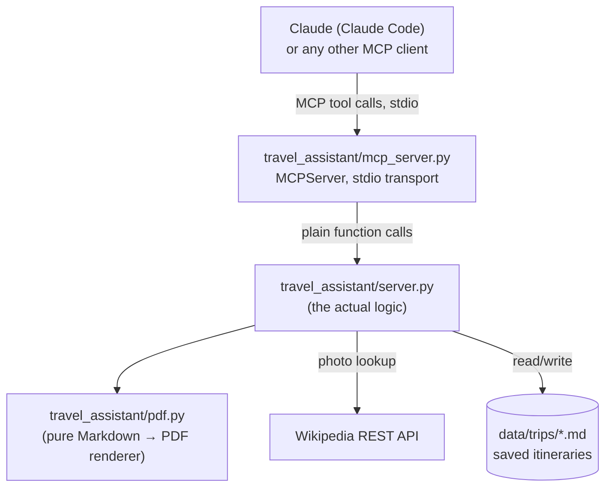

# Architecture

## Overview

This project is a **server layer plus an MCP adapter over it**: a small set
of plain Python functions that a trip-planning agent needs (`server.py`),
and a thin MCP server (`mcp_server.py`) that exposes each one as a tool
over stdio. There is no agent framework, no LLM client, no web server, no
CLI loop anywhere in this codebase. That's a deliberate scope cut from an
earlier version of this project, which bundled an OpenAI-Agents-SDK
triage/specialist agent graph, a Flask chat UI, and a terminal REPL
directly into the same codebase — coupling "what a trip-planning tool can
do" to "how one particular agent framework calls it."

The shape now is layered:

`server.py` has no framework imports at all — it doesn't know or care
whether its caller is the MCP adapter, a test, or a one-off script.
`mcp_server.py` is the only file in this repo that imports `mcp`.

## Components

| File | Responsibility |
|---|---|
| [`travel_assistant/server.py`](../travel_assistant/server.py) | The actual logic: `save_itinerary`, `get_trip`, `list_trips`, `get_destination_photo`, `render_trip_pdf`. Plain functions, plain types in and out (`str`, `list[str]`), no side channel state beyond the filesystem. |
| [`travel_assistant/mcp_server.py`](../travel_assistant/mcp_server.py) | Wraps each `server.py` function in an `@mcp.tool()` and serves them via `mcp.server.mcpserver.MCPServer.run()` over stdio (the default transport). Each tool's docstring is exactly what an MCP client sees as the tool description — no separate spec to keep in sync. |
| [`travel_assistant/pdf.py`](../travel_assistant/pdf.py) | Unchanged from the original design: turns the restricted Markdown subset used by saved itineraries (headings, bullets, bold, one embedded image) into PDF bytes via `fpdf2` + `Pillow`. Has no knowledge of `server.py`'s or `mcp_server.py`'s callers. |
| [`.mcp.json`](../.mcp.json) | Registers `travel-assistant` as a project-scoped MCP server for Claude Code: runs `venv/bin/python -m travel_assistant.mcp_server`. |
| `data/trips/*.md` (gitignored) | Source of truth for saved itineraries. `data/trips/*.pdf` is a generated artifact of `render_trip_pdf`, never hand-edited, safe to delete and regenerate. |

## Why stdio, and why one process per client

`MCPServer.run()` defaults to `transport="stdio"`: the client (Claude Code)
spawns `python -m travel_assistant.mcp_server` as a subprocess and speaks
MCP over its stdin/stdout, one process per connected client, no listening
port, nothing reachable off the local machine. That matches this project's
actual requirement ("local host is fine") without any of the complexity of
running an HTTP/SSE server — auth, CORS, a port to manage, a process to
keep alive between sessions. If a future need arises for multiple clients
sharing one long-lived server, `mcp.run(transport="streamable-http")` is a
one-line change; nothing in `server.py` would need to change at all, since
it has no idea a transport exists.

## Error handling across the MCP boundary

`server.py` functions raise plain `FileNotFoundError` for a missing trip
(see `get_trip`, `render_trip_pdf`). The MCP server layer (via `MCPServer`)
catches that automatically and reports it to the client as a tool error
(`CallToolResult.is_error = True`) carrying the exception message — verified
by a manual stdio-client smoke test during development. `server.py` itself
has no MCP-specific error handling; the adapter does that translation, same
as it does for exposing docstrings as tool descriptions.

## Function reference

| Function | Input | Output | Notes |
|---|---|---|---|
| `save_itinerary(trip_name, itinerary_markdown)` | trip name, full itinerary as Markdown | confirmation string with the saved path | Slugifies `trip_name` for the filename; overwrites if the slug already exists. |
| `get_trip(trip_name)` | trip name | the saved Markdown | Raises `FileNotFoundError` if nothing matches the slug. |
| `list_trips()` | — | sorted list of saved trip slugs | Empty list if `data/trips/` doesn't exist yet. |
| `get_destination_photo(place)` | a place name | Markdown image syntax, or a "no photo found" string | Never raises on a failed lookup — a missing photo is a normal, representable result, not an error. Never invents a URL. |
| `render_trip_pdf(trip_name)` | trip name | path to the generated PDF | Raises `FileNotFoundError` if the trip isn't saved. Regenerates from the `.md` every call — the PDF itself is never treated as a source of truth. |

## Design choices carried over from the original app

- **PDFs are never stored as the source of truth.** Only the `.md` is
  authoritative; `render_trip_pdf` can always regenerate the PDF from it.
  This avoids the two files drifting out of sync.
- **`get_destination_photo` fails soft.** A network error or missing photo
  returns a plain string ("No photo found for X"), not an exception —
  callers that embed this text directly in a reply don't need a
  try/except for the common case.
- **PDF fonts are Latin-1 only** (`fpdf2`'s core "Helvetica" font).
  Characters outside that range degrade to `?`; common typographic Unicode
  (curly quotes, em-dashes, `…`) is normalized to ASCII first. A bundled
  Unicode TTF would fix this but wasn't worth the dependency weight.
- **No caching on `get_destination_photo`.** Every call hits Wikipedia's
  REST API live. Fine at the volume a single interactive agent generates;
  would need caching before any higher-volume or multi-caller use.

## What was deliberately removed

The previous version of this project had, in the same codebase:

- An OpenAI-Agents-SDK agent graph (`agent_defs.py`): a triage agent
  handing off to an Itinerary Planner and a Trip Logistics agent, each
  with its own prompt-engineered instructions and `WebSearchTool`.
- A CLI REPL (`main.py`) and a Flask web chat app (`web.py` +
  `templates/chat.html`), each independently tracking "which agent should
  handle the next message" per session, plus a `SQLiteSession` conversation
  store and a `session_agents.json` state file.

All of that was agent-framework and front-end plumbing, not trip-planning
logic — none of it is reflected in this package anymore. The itinerary
planning and trip logistics *behavior* (ask for missing essentials before
planning, always attach a destination photo, always tell the user to
verify visa/entry rules officially, only save on confirmation, not mid-draft)
now lives as a Claude Code skill (`.claude/skills/travel-assistant/`)
driving the MCP tools, not as Python code here.

## Extending this project

- **Add a new capability**: write a plain function in `server.py` with a
  clear docstring, then add a matching `@mcp.tool()` wrapper in
  `mcp_server.py` that calls it — the docstring on the *wrapper* is what
  an MCP client sees as the tool description, so keep it in sync with the
  underlying function's.
- **Change what gets saved/exported**: `save_itinerary`/`get_trip` and
  `pdf.py` are independent — this package only ever persists Markdown;
  PDF is a pure, regeneratable presentation-layer transform.
- **Change transport**: `mcp.run(transport=...)` in `mcp_server.py` accepts
  `"stdio"` (current), `"sse"`, or `"streamable-http"` — switching doesn't
  touch `server.py` at all.
