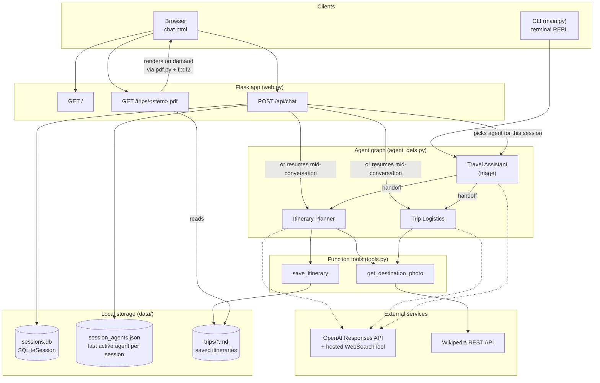
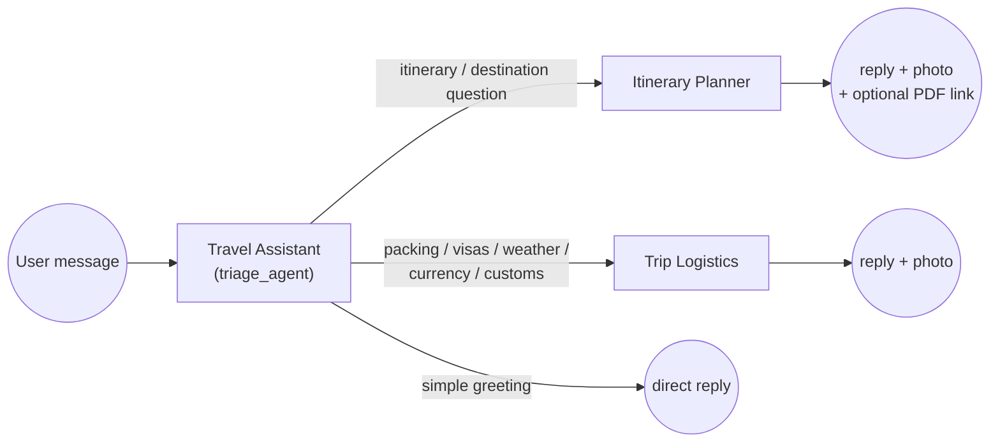
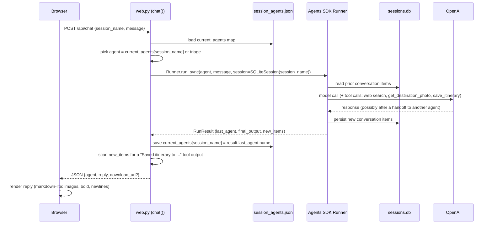

# Architecture

## Overview

Travel Assistant is a small multi-agent app built on the [OpenAI Agents SDK](https://openai.github.io/openai-agents-python/). A single **triage agent** reads the user's message and hands the conversation off to one of two specialists — an **Itinerary Planner** or a **Trip Logistics** agent — each with its own instructions and tools. There are two front doors onto the same agent graph: a terminal CLI and a Flask web chat UI. Both share the same conversation storage, so a trip started in one can, in principle, be continued via the other (same session name, same SQLite file).

There is no separate "backend service" beyond Flask itself — the web app *is* the backend. There's no database server, no queue, no build step for the frontend (a single server-rendered HTML file with inline CSS/JS). This is intentionally minimal: a personal, single-user, local tool.

## System diagram



## Components

| File | Responsibility |
|---|---|
| [`travel_assistant/agent_defs.py`](../travel_assistant/agent_defs.py) | Defines the three agents (`triage_agent`, `itinerary_agent`, `logistics_agent`): their instructions, tools, and handoff wiring. This is the "brain" of the app — almost all behavior is steered from here via prompt instructions, not code. |
| [`travel_assistant/tools.py`](../travel_assistant/tools.py) | Two `@function_tool`-decorated functions the agents can call: `save_itinerary` (writes a Markdown file to `data/trips/`) and `get_destination_photo` (looks up a photo via Wikipedia). |
| [`travel_assistant/pdf.py`](../travel_assistant/pdf.py) | Pure rendering module: turns the restricted Markdown subset used by saved itineraries (headings, bullets, bold, one embedded image) into PDF bytes via `fpdf2` + `Pillow`. Has no knowledge of Flask or the agents. |
| [`travel_assistant/main.py`](../travel_assistant/main.py) | CLI entry point (`python -m travel_assistant.main`). A `while True` REPL loop around `Runner.run_sync`. |
| [`travel_assistant/web.py`](../travel_assistant/web.py) | Flask entry point (`python -m travel_assistant.web`). Three routes: serve the chat page, handle a chat turn, and render/download a saved itinerary as PDF. |
| [`travel_assistant/templates/chat.html`](../travel_assistant/templates/chat.html) | The entire web frontend: one file, inline CSS + vanilla JS, no build step, no framework. Talks to the backend only via `POST /api/chat`. |
| `data/` (gitignored) | All runtime state: `sessions.db` (conversation history), `session_agents.json` (which agent is "active" per session), `trips/*.md` (saved itineraries — the source of truth; PDFs are generated on demand, never stored). |

## Agent design

### Handoff pattern



The triage agent (`name="Travel Assistant"`) has no tools of its own — only `handoffs=[itinerary_agent, logistics_agent]`. The Agents SDK exposes each handoff to the model as a callable (`transfer_to_<agent_name>`); the triage agent's instructions tell it when to use each one, and it can also just answer directly for small talk. Once a specialist takes over, **that agent keeps answering follow-up messages directly** — the SDK does not automatically return control to triage. `web.py` and `main.py` both track "whichever agent answered last" and route the *next* message straight to it, skipping triage on continued turns.

### Tool wiring per agent

| Agent | Tools | Notes |
|---|---|---|
| Travel Assistant (triage) | *(none — just handoffs)* | Deliberately kept tool-free so it can't get distracted from routing. |
| Itinerary Planner | `WebSearchTool()` (hosted), `save_itinerary`, `get_destination_photo` | `WebSearchTool` is OpenAI's built-in hosted tool (no code here — the model calls out to it directly for time-sensitive facts like opening hours or seasonal events). |
| Trip Logistics | `WebSearchTool()`, `get_destination_photo` | No `save_itinerary` — logistics answers aren't itineraries and aren't meant to be saved. |

### Why the photo tool is "required" in the prompt, not enforced in code

`get_destination_photo` is a plain function tool — nothing forces the model to call it. Early on, a softer instruction ("use this when helpful") was unreliable: the model would skip it, especially once it was already citing web search results. The instructions were rewritten to be explicit and unconditional ("every single reply... call `get_destination_photo`... paste the exact Markdown string as the first line") and that fixed it in practice. This is a prompt-engineering constraint, not a code-level guarantee — a future model version or edge-case phrasing could still skip it. If that ever matters, the fix is architectural (e.g. a guardrail or post-processing step that checks for an image and force-calls the tool if missing), not another instruction tweak.

## Request lifecycle: a chat turn (web)



Two things persisted here matter more than they look:

1. **`sessions.db`** is the Agents SDK's own `SQLiteSession` — it stores the actual conversation (what the model needs for context). This existed from the start.
2. **`session_agents.json`** is this app's own addition. It answers a question the SDK doesn't track for you: *which agent should receive the next message in this session?* Without it, every turn would start over at triage. It was added after a real bug: Flask's debug auto-reloader restarts the Python process on every code save, which wiped an in-memory version of this mapping and silently dropped active conversations back to triage mid-use. Persisting it to disk fixed that.

## Itinerary save → PDF download flow

```mermaid
sequenceDiagram
    participant Browser
    participant Flask as web.py
    participant Tool as save_itinerary (tools.py)
    participant FS as data/trips/*.md
    participant PDF as pdf.py

    Note over Flask,Tool: During a normal chat turn, once the user confirms the plan
    Flask->>Tool: (via agent tool call) save_itinerary(trip_name, markdown)
    Tool->>FS: write {slug}.md
    Tool-->>Flask: "Saved itinerary to .../data/trips/{slug}.md"
    Flask->>Flask: regex-match that return string in new_items,<br/>extract the file stem
    Flask-->>Browser: reply JSON includes download_url = /trips/{slug}.pdf

    Note over Browser,PDF: Later, when the user clicks the download link
    Browser->>Flask: GET /trips/{slug}.pdf
    Flask->>Flask: resolve path, confirm it's inside data/trips/ (traversal guard)
    Flask->>FS: read {slug}.md
    Flask->>PDF: markdown_to_pdf(text, title)
    PDF->>PDF: parse headings/bullets/bold; download + downscale embedded photo (Pillow)
    PDF-->>Flask: PDF bytes
    Flask-->>Browser: application/pdf, Content-Disposition: attachment
```

Key design choice: **PDFs are never stored** — only the `.md` is saved by the agent tool. Every download regenerates the PDF from the Markdown source. This keeps the saved trip data as a single, human-readable source of truth and avoids the two files drifting out of sync.

## Frontend architecture

`chat.html` is deliberately a single self-contained file: inline `<style>`, inline `<script>`, no npm/build step, no framework, no CDN dependency. Rationale: this is a personal local tool, not a product — the maintenance cost of a build pipeline isn't worth it for one page.

Notable pieces:

- **Session identity**: the visible "Trip" field is empty by default (placeholder only). Under the hood, `newSessionId()` generates a random id per page load so an unnamed chat still gets a real, unique backend session and never collides with another tab. Typing a name switches to (or starts) a named, resumable trip and clears the visible message list (the actual server-side history for that session is untouched — only the DOM view resets, since there's no "fetch past messages" endpoint yet).
- **Markdown rendering is intentionally minimal and escaping-first** (`renderMarkdownLite`): the model's raw text is first HTML-escaped via `textContent`, then exactly two patterns are re-inflated into real HTML — `` → `` and `**bold**` → `<b>`. Everything else stays literal text. This is a deliberate security boundary: agent output is LLM-generated, not user-typed, but it's still not treated as trusted HTML (prompt injection could otherwise ask the model to emit `<script>` or arbitrary markup).
- **Per-agent visual identity**: the sender label is slugified (`slugify()`) and mapped to a colored gradient + emoji avatar (`AVATARS`), so Travel Assistant / Itinerary Planner / Trip Logistics are visually distinct in the transcript.
- **No client-side state beyond the DOM** — no localStorage, no client-side routing. Reload the page and (unless you type a trip name) you get a fresh, empty chat by design.

## Known limitations / deliberate tradeoffs

- **Single-user, local-only.** No auth, no multi-tenant isolation. `session_agents.json` and `sessions.db` are flat local files. Fine for personal use; would need real accounts/isolation before sharing with others.
- **Flask dev server.** `app.run(debug=True)` — not production-grade (no WSGI server, debugger is live, auto-reloader). Acceptable for a local tool; would need `gunicorn`/`waitress` etc. for anything beyond that.
- **Python 3.9 compatibility gotcha.** The venv in this project runs 3.9, which doesn't support `X | None` return-type syntax without `from __future__ import annotations` (present at the top of `web.py`). This bit the project twice during development — once via a third-party package (`openai` 2.48 vs. `openai-agents` 0.8.4, fixed by pinning `openai<2.48.0` in `requirements.txt`) and once in this project's own code. Upgrading the venv to Python 3.10+ would remove this whole class of issue.
- **PDF fonts are Latin-1 only.** `pdf.py` uses `fpdf2`'s core "Helvetica" font, which only supports Latin-1. Characters outside that (e.g. Czech `č`, Vietnamese diacritics, CJK) degrade to `?`. Common typographic Unicode (curly quotes, em-dashes, bullets, `…`) is normalized to ASCII first. A real Unicode font (e.g. bundling a DejaVu Sans TTF) would fix this but wasn't worth the added dependency weight for the common case.
- **Photo tool reliability is prompt-driven, not code-enforced** (see above) — the model could in principle skip it.
- **`get_destination_photo` has no caching.** Each call hits Wikipedia's REST API live. Fine at this app's volume (one interactive user); would need caching before any higher-volume or multi-user use.
- **Agent routing is LLM judgment, not a hard state machine.** Triage *usually* hands off correctly per its instructions, but like any prompted behavior it isn't 100% guaranteed for edge-case phrasing.

## Extending this app

- **Add a new specialist agent**: define it in `agent_defs.py` (instructions + tools), add it to `triage_agent`'s `handoffs=[...]` list, and add it to `_AGENTS_BY_NAME` in `web.py` so the web UI can track/resume it across turns.
- **Add a new tool**: write a plain Python function in `tools.py`, decorate with `@function_tool` (the docstring becomes the tool description the model sees), and add it to the relevant agent's `tools=[...]` list in `agent_defs.py`.
- **Change what gets saved/exported**: `save_itinerary` and `pdf.py` are independent — the agent only ever produces and saves Markdown; PDF is a pure presentation-layer transform applied at download time.
